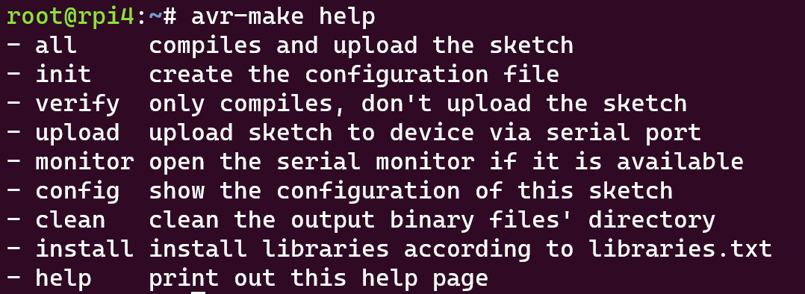

## avr-make
a shell and makefile based tool for arduino based sketch by using arduino-cli, it has been tested by arduino uno, esp32, esp8266, rpipico and rpipicow
### setup
1. cd ~ && git clone https://github.com/chowhao/avr-make.git
2. export PATH=~/avr-make/bin:$PATH
3. or echo "PATH=~/avr-make/bin:$PATH" >> .bashrc && source .bashrc

### usage
you can try "avr-make help" to get help page as follows

   

### example
1. cd ~ and make a directory, such as mkdir hello, cd hello
2. touch hello.ino, vim or gedit hello.ino, paste a copy of aduino code
3. type "avr-make help" for help, usually it will print out as usage section
4. type "avr-make init" to create config.txt, specify the config file
5. type "avr-make config" to print out the FQBN, PROJ, DEVS variables
6. type "avr-make verify" for verify code, type "avr-make upload" for upload
7. type "avr-make monitor" for opening the arduino-cli monitor

### notice
###### 1. the config.txt inclues PROJ, FQBN, DEVS variables
1. PROJ is the name of project, there should be a PROJ.ino in current project dicrectory
1. FQBN is Fully Qualified Board Name, you can get it by command "arduino-cli board listall"
3. DEVS is the port of the board, usually /dev/ttyACM* or /dev/ttyUSB* in Linux and COM* in Windows
###### 2. there are some eaxmples in test directory
1. avr is for ardunio, esp/dev is for esp32, esp/node is for esp8266, rpi/pico is for rpipico board, rpi/picow is for rpipicow board
2. blink for blink the on board led, hello is for print out "hello world" to serial monitor, wifi is for rpipicow only for wifi connection
###### 3. specify the installation directory
1. if you don't want to install in home directory, you should change the FILE variable in bin/avr-make.
2. the FILE variable is related to where the Makefile is
