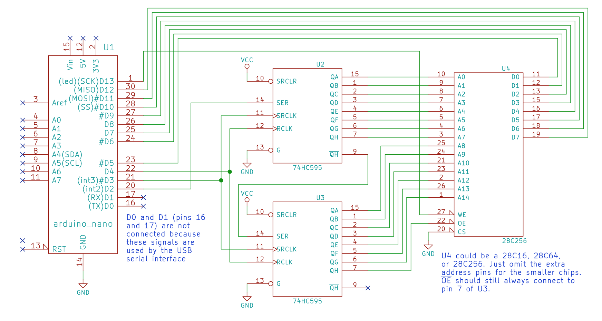
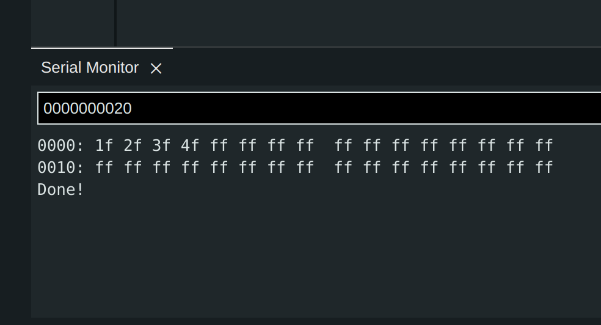
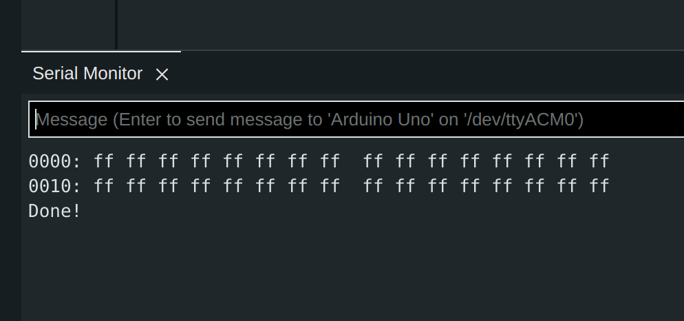

### Introduce

A command line tool to program 28cxx series eeprom by arduino uno

Sometimes, we need to burn a binary file to eeprom, the burn tool like (tl886 ii plus) is a little expensive, so we can make a programmer by ourselves

I choose the arduino uno to make a eeprom programmer to program 28cxx series eeprom chip,
it can program the 28c256 eeprom chip perfectly right now !!!

#### First Part (Hardware)

##### schematic

The schematic(the below picture) is very simple, it just consists of two 74hc595 chip, you can even build it on breadboard

    

#### Second Part (Software)

##### Arduino program

The receive.ino is for arduino uno, compile it and upload to your arduino uno, then open serial monitor at 9600 baurate

Type 0000000020 and send, you can see some output in serial monitor,  00 is the read command,  0000 is orginal address,  0020 is byte number,
It means read 0x0020 bytes from orginal address 0x0000, the output is [here](https://github.com/2076625923/arduino-programmer/blob/main/png/dump.png)

There are two other commands write and erase

0100001f2f3f4f --> write 0x1fh, 0x2fh, 0x3fh, 0x4fh from address 0x0000 to at28c256 eeprom, the result after write those bytes is the png/write.png (the left below picture)

0e00000010 --> erase 0x0010 bytes from address 0x0000 to 0x0010, the result after erase is the png/erase.png (the right below picture)

                  

##### C program

Based on the arduino program, we can write,read,erase some bytes in 28c256 by arduino uno, But it can't work very efficiencily

For example, we have to write bytes manually, we can't burn a binary file to 28c256 by standalone arduino program

So I create the unopro.c to read binary file from PC, then send data to arduino uno to complete the program progress

###### compile
``` gcc unopro.c -o unoPro ```
###### connect
``` unoPro 9600 /dev/ttyACM0 ```
###### usage

The are dump,write,erase,load,help commands, some usage is as follows

``` dump 0000 0040 ```  ----> read 0x0040 bytes from orginal address 0x0000

``` write 0100 1f2f3f4f5f ```  ----> write 0x1fh, 0x2fh, 0x3fh, 0x4fh from 0x0100

``` erase 0020 0100 ```  ----> erase 0x0100 bytes from orginal address 0x0020

``` load 0100 a.bin ```  ----> write a.bin to at28c256 from orginal address 0x0100

[more usage](png/fix.png) is shown in png/fix.png

### Bugs

After erase and load command, there is some error chars in the first line of dump command output [bugs](png/bugs.png)

### Update

Now, I have fix above bugs it can work perfectly

### Reference

https://github.com/beneater/eeprom-programmer
